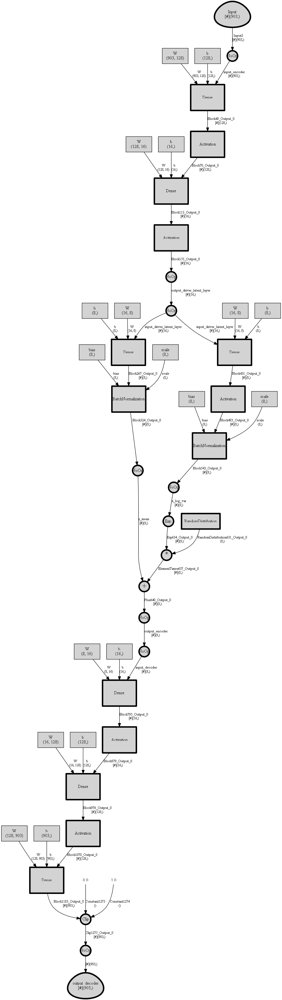

# Cntk-VAE
Cntk variational auto encoder

Another implementation of variational auto encoder based on https://towardsdatascience.com/intuitively-understanding-variational-autoencoders-1bfe67eb5daf. 

This variational auto encoder is trained on crypto currencies history dataset, this dataset was downloaded on https://www.binance.com with python API https://github.com/sammchardy/python-binance.

Binance proposed 129 currencies, and i took 7 variables for each currency.
That made the model input vector to be 129 * 7  = 903

## Here is the model

## Results

This a piece of the results.

The input | The output (generated) | The difference
-|-|-
||

